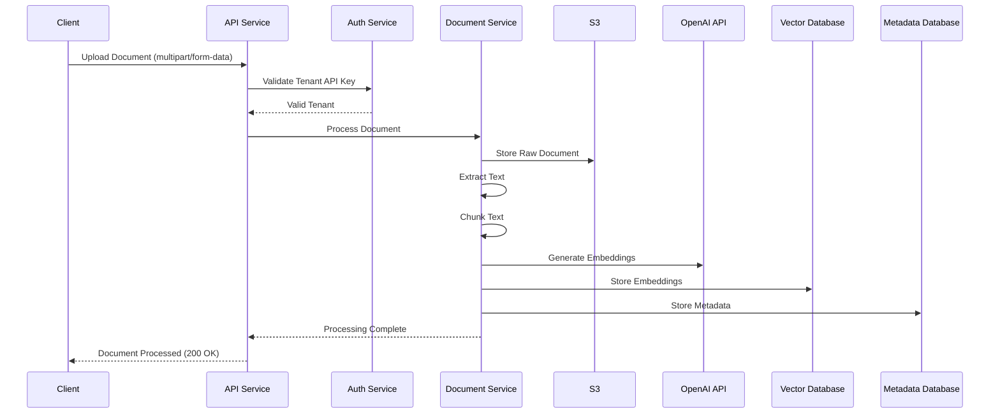
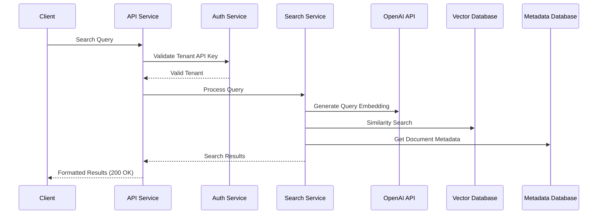

# S4 Architecture Overview

This document provides a detailed overview of the S4 architecture, explaining how the different components interact to provide a scalable, multi-tenant semantic search service.

## System Architecture

S4 is designed with a microservices architecture that includes the following main components:

### Core Components

1. **API Service**: FastAPI-based RESTful API that handles all client requests
2. **Auth Service**: Manages authentication and authorization for tenants and admins
3. **Document Service**: Processes and manages document uploads
4. **Search Service**: Handles semantic search queries
5. **Admin Service**: Provides tenant management and system administration
6. **Analytics Service**: Collects and processes usage data

### Data Stores

1. **Document Storage (S3)**: Amazon S3 for raw document storage
2. **Vector Database**: Stores document embeddings for semantic search
3. **Metadata Database**: Stores document metadata, tenant information, and system configuration

### Frontend Components

1. **User Dashboard**: React-based UI for document management and search
2. **Admin Portal**: Management interface for administrators

## Data Flow

### Document Upload and Processing

1. Client uploads a document via the API
2. API Service authenticates the request and validates the document
3. Document Service stores the raw document in S3
4. Document Service extracts text from the document
5. Document Service chunks the text and generates embeddings using OpenAI's API
6. Vector embeddings are stored in the Vector Database
7. Metadata is stored in the Metadata Database
8. Client is notified of successful processing

### Semantic Search

1. Client sends a search query via the API
2. API Service authenticates the request
3. Search Service converts the query to an embedding using OpenAI's API
4. Search Service performs similarity search in the Vector Database
5. Search Service retrieves matching documents and chunks
6. Search Service enhances results with metadata from the Metadata Database
7. Results are returned to the client

### Tenant Management

1. Admin accesses the Admin Portal or API
2. Auth Service authenticates the admin
3. Admin Service processes tenant management requests
4. Changes are stored in the Metadata Database
5. Analytics Service tracks system usage

## Multi-Tenant Design

S4 implements a robust multi-tenant architecture:

### Tenant Isolation

- **Storage Isolation**: Each tenant's documents are stored in isolated S3 paths
- **Data Isolation**: Vector embeddings and metadata are partitioned by tenant ID
- **Rate Limiting**: Each tenant has their own usage quotas based on subscription plan
- **Authentication**: Tenant-specific API keys ensure proper isolation

### Subscription Plans

Subscription plans define:

- Maximum storage allocation
- API rate limits
- Feature availability
- Document processing priority

## Scalability

S4 is designed to scale horizontally:

- **Stateless API Layer**: All API services are stateless and can be scaled horizontally
- **Distributed Processing**: Document processing can be distributed across multiple workers
- **Caching Layer**: Redis caching for frequently accessed data
- **Database Sharding**: Vector and metadata databases can be sharded for high volume

## Security Architecture

### Authentication

- **API Key Authentication**: All API requests require valid API keys
- **JWT Tokens**: Admin Portal uses short-lived JWT tokens
- **Role-Based Access Control**: Different permission levels for tenants and admins

### Data Security

- **Encryption at Rest**: All data in S3 and databases is encrypted at rest
- **Encryption in Transit**: All API communications use HTTPS
- **Key Rotation**: Support for regular API key rotation
- **Tenant Isolation**: Strong boundaries between tenant data

### Audit Logging

- All administrative actions are logged for audit purposes
- API access logs track usage patterns
- Security events are monitored and logged

## Infrastructure Requirements

### Minimum Requirements (Development)

- 2 CPU cores
- 4GB RAM
- 10GB storage
- Docker 20.10+
- Python 3.9+
- Node.js 16+

### Recommended Requirements (Production)

- 4+ CPU cores
- 8GB+ RAM
- 100GB+ storage
- AWS account with S3, ECS/Fargate or Elastic Beanstalk
- OpenAI API account

## Language and Frameworks

### Backend

- **Python 3.9+**: Core programming language
- **FastAPI**: API framework
- **Pydantic**: Data validation
- **SQLAlchemy**: ORM for metadata database
- **Boto3**: AWS S3 integration
- **OpenAI API**: Embedding generation

### Frontend

- **React 18+**: UI framework
- **React Router**: Navigation
- **React Bootstrap**: UI components
- **Axios**: API communication
- **React Query**: Data fetching and caching

## Deployment Options

S4 supports multiple deployment options to fit different use cases:

1. **Docker Compose**: For local development and testing
   - All components run in Docker containers
   - LocalStack for S3 emulation (optional)

2. **AWS Elastic Beanstalk**: For production deployment
   - API deployed to Elastic Beanstalk
   - UI deployed to Amplify
   - S3 for document storage
   - RDS for metadata database

3. **AWS ECS/Fargate**: For scalable production deployment
   - Containerized deployment on ECS
   - Fargate for serverless container management
   - ALB for load balancing
   - S3 for document storage
   - RDS for metadata database

4. **Custom Infrastructure**: For specialized requirements
   - Can be adapted to other cloud providers
   - Kubernetes deployment option
   - On-premises deployment possible

## System Monitoring

### Key Metrics

- API response times
- Document processing times
- Search latency
- Storage usage
- API call volume
- Error rates
- Tenant activity

### Monitoring Tools

- Application logs (JSON format)
- Prometheus metrics (optional)
- AWS CloudWatch integration
- Health check endpoints

## Disaster Recovery

### Backup Strategy

- Regular S3 bucket backups
- Database snapshots
- Configuration backups
- Tenant data exports

### Recovery Procedures

- Database restoration process
- S3 data recovery
- Environment recreation scripts

## Future Architecture Enhancements

Planned enhancements to the S4 architecture include:

1. **Enhanced Vector Search**: Implementation of hybrid search combining semantic and keyword search
2. **Real-time Processing**: Stream-based document processing for real-time updates
3. **Fine-tuning Options**: Allow tenants to fine-tune embeddings for domain-specific search
4. **Advanced Analytics**: ML-based usage pattern analysis and anomaly detection
5. **Serverless Components**: Transition to more serverless architecture for improved scaling

## Conclusion

The S4 architecture is designed for scalability, security, and multi-tenant isolation. By leveraging modern cloud services and containerization, S4 provides a robust platform for semantic search that can grow with your organization's needs. 